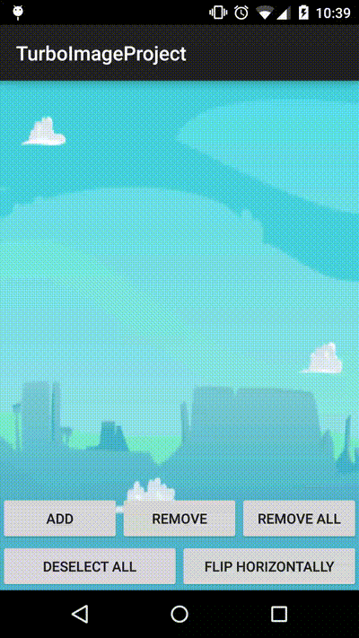

# TurboImageProject
[](http://twitter.com/drmunon)
[](http://github.com/Mun0n/TurboImageProject/issues)
[](http://opensource.org/licenses/MIT)


TurboImageView let you to add a complete interactive ImageView to your interface!



With this ImageView you can drag, resize and rotate your drawables. Easy to implement, follow this simple steps:

1. Add the TurboImageView to your project, via maven

```gradle
compile 'com.munon:turboimageview:1.0.4'
```

2. Add the TurboImageView to your layout, put over other ImageView if you want to set the drawables over it.

```xml
<com.munon.turboimageview.TurboImageView
        android:id="@+id/turboImageView"
        android:layout_width="match_parent"
        android:layout_height="match_parent" />
```

3. Load the images in your activity using the loadImages method:

```java
turboImageView.loadImages(this, R.drawable.ic_launcher);
````

4. Remove the last selected view using the deleteSelected method:

```java
turboImageView.deleteSelectedObject();
```

5. If you need to remove the selected view (for example to make a screenshot), you will need this method:

```java
turboImageView.deselectAll();
```

I'm looking for put a delete button in the top left corner of an image, but at this moment I'm not capable to get the touch event in that point. If you want to help, fork me and take a look on the MultiTouchController class and the ImageObject class (where the implementation to show the close icon is done). THANKS!

Thanks to [hrules6872](https://github.com/hrules6872) and [alexruperez](https://github.com/alexruperez) for helping me to upload this lib to github and maven! 

DONE!

